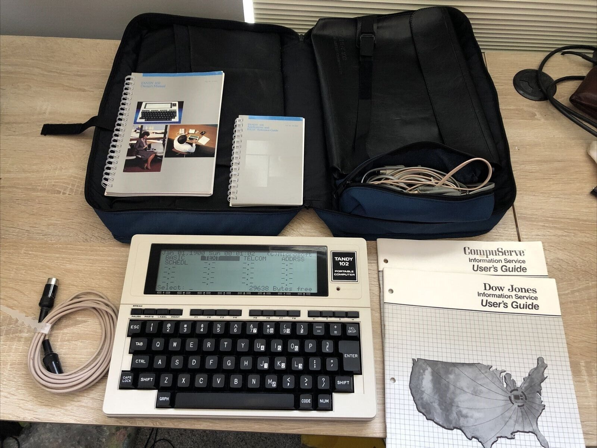

# TRS-80 M100 (and friends) Archive

## ASM

I am using this [8085 assembler](https://github.com/lcgamboa/8085asm), and it seems to work. To make things easier, I produced a header file, `header.asm`, that lists all the function calls I could find in the Technical Manual. I will test these in time.

I did a first quick test, called of course `test.asm`, including the header file, and it compiled properly (I think), as an Intel HEX file. I used [`hex2bin.py`](https://python-intelhex.readthedocs.io/en/latest/part3-1.html#script-hex2bin-py) to convert to `test.co`. I might write a small utility to convert it to a BASIC code that POKEs data, if that makes sense and helps.

In the end I am planning to build a small GUI application that will take care of most of the process building an ASM application, but I'll take it one step at a time...

## Docs

I am trolling the web to find and archive docs about the TRS-80 M100. Anything that looks useful will be dumped in `Docs`.

## CO_FILES

I can't remember just now where I found these, but I will link back when I do. The idea here is to archive, not steal :-)

My T102 as of 2022/08/28